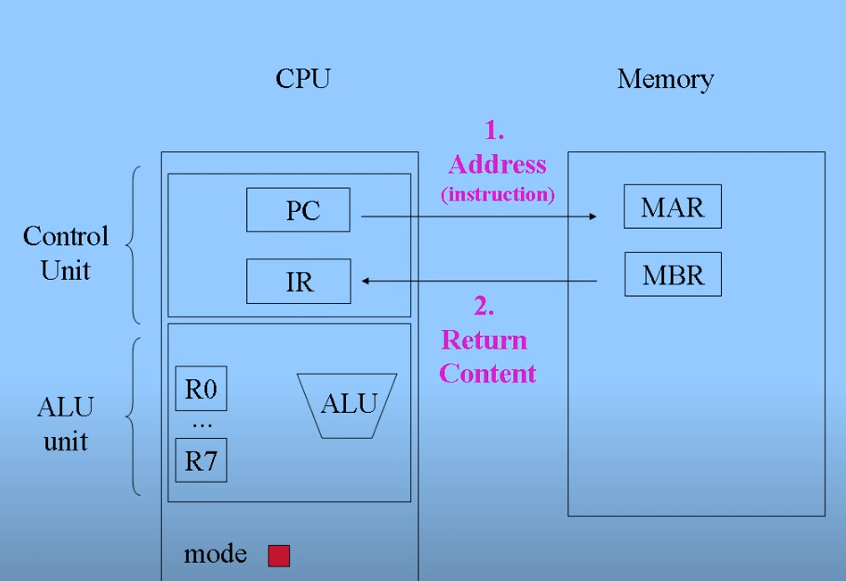
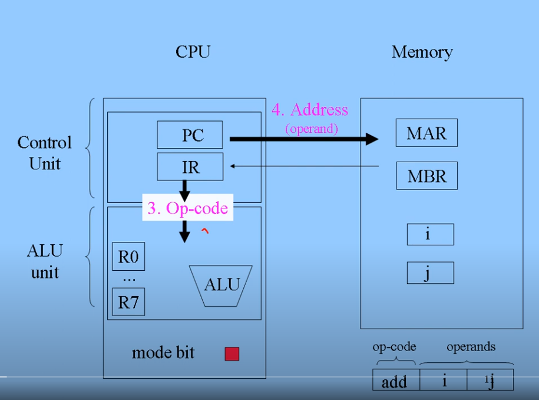
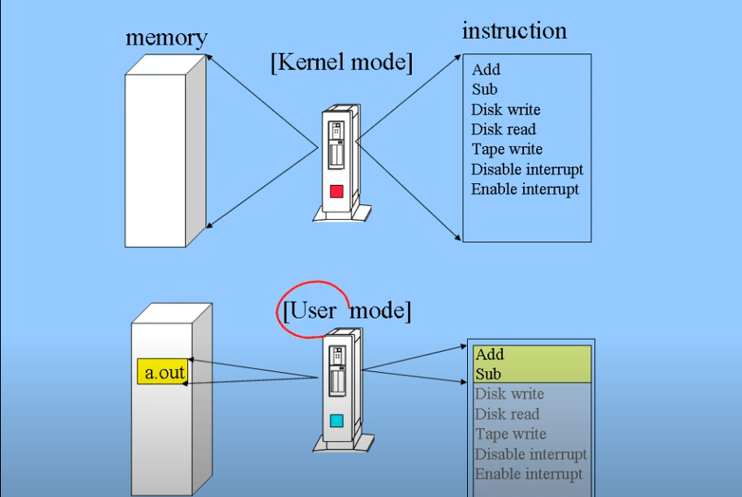
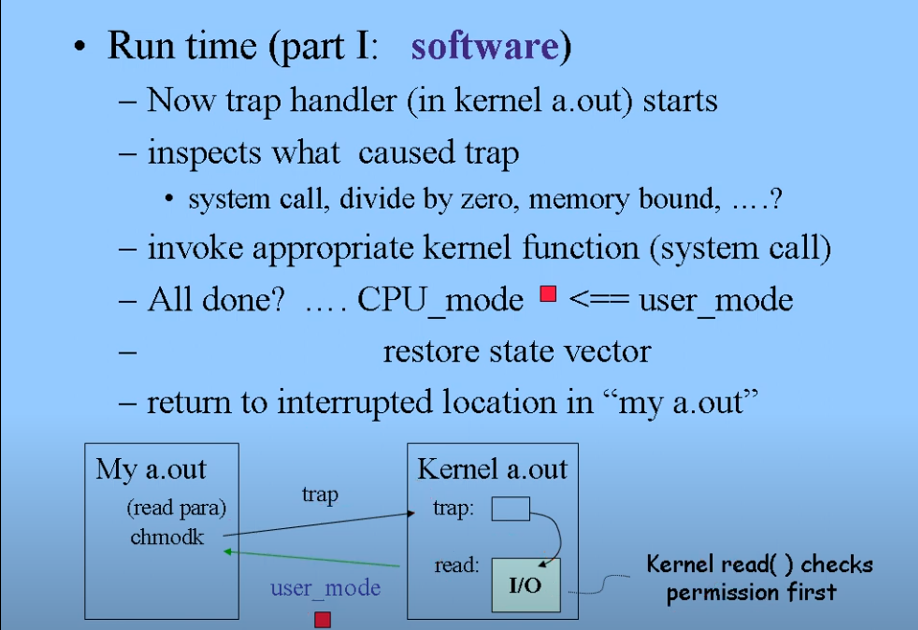
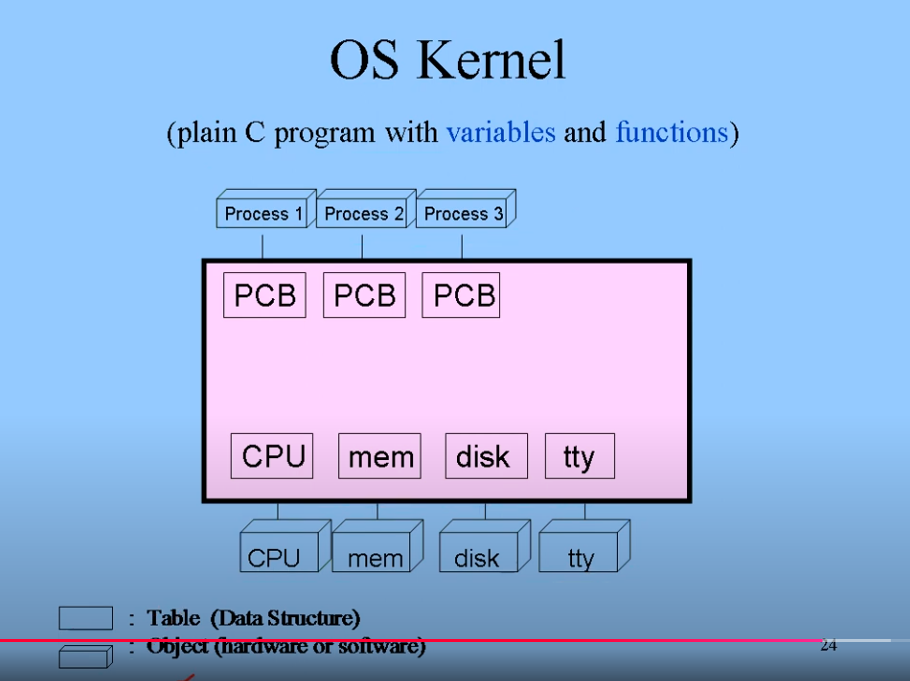

# Introduction to Kernel
커널은 세 파트로 구성된다
- 프로세스 관리
- 파일 시스템
- I/O 시스템

## Protection
UNIX는 멀티 유저 시스템이므로 Protection이 중요하다.
프로그램이 악의적으로 다른 파일을 수정할 수 없게, 커널을 통해서만 시스템과 관련된 명령어(I/O 입출력 ...)를 실행하게 해야 한다 -> System call
즉, 프로그램은 커널을 통해서만 시스템 명령어를 실행할 수 있다.

protection을 위해 CPU는 mode-bit을 사용한다.

- mode-bit이 user mode에 있으면, 메모리는 running하고 있는 프로그램의 주소 공간만 접근할 수 있고, 프로그램이 사용할 수 있는 op-code가 제한된다.
  - I/O 명령어 수행 불가
  - special registers(program counter, step counter, memory mapping register ...) 접근 불가
- mode-bit이 kernel mode에 있으면 메모리 상 모든 주소 공간에 접근할 수 있고, 모든 op-code를 사용할 수 있다.

protection은 소프트웨어만으로는 제어할 수 없기 때문에 하드웨어의 도움이 필요하고, 이것이 CPU 안에 있는 mode-bit이다.
- mode-bit은 PSW(Process Status Word) 레지스터에 속해 있다.
- kernel mode에서만 PSW에 접근할 수 있다.
- [ARMv8 PSTATE](https://yohda.tistory.com/entry/%EC%9D%B4%EB%A1%A0%EC%BB%B4%ED%93%A8%ED%84%B0%EA%B5%AC%EC%A1%B0ARM-ARMv8-%ED%94%84%EB%A1%9C%EC%84%B8%EC%84%9C-%EC%83%81%ED%83%9C)

mode-bit이 user mode면 커널은 CPU의 명령(op-code, 주소 접근, I/O 명령)을 항상 모니터링한다. 만약 권한이 맞지 않으면 trap.

프로그램이 system call 함수를 바이너리로 컴파일하면, 해당 시스템콜은 `chmodk`와 같은 명령어로 변경된다. (Linux에서도 그럴까?)
- CPU의 mode-bit을 kernel mode로 변경하는 명령어
- CPU는 이 명령어를 user mode에서 실행할 수 없으므로 trap을 발생시킨다.
  - CPU State Vector를 하드웨어에 저장
  - Trap handling routine으로 하드웨어가 진행
    - 이 과정에서 하드웨어가 CPU mode-bit을 kernel mode로 변경한다.
    - trap handler 안에서 커널이 프로그램이 trap을 발생시킨 이유를 조사한다.
      - system call? divide by zero? ...
    - 이유를 파악하고 필요한 커널 함수를 실행한다.
    - 모든 일을 마치면 커널은 CPU mode-bit을 user mode로 변경하고, CPU State Vector를 복원한 다음, 프로그램의 진행 경로로 다시 돌아간다.

## Process management

유저 프로그램의 실행을 위해선 user stack과 kernel stack이 필요하다.
커널은 실행되는 수많은 프로그램을 지원해야 하고, 실행되는 프로그램을 관리하기 위한 데이터 구조가 필요하다 -> PCB (Process Control Block)
동시에 하드웨어 자원을 관리해야 한다 - 이 역시 하드웨어마다 대응되는 데이터 구조를 가져야 한다.

실행되는 프로그램은 ready queue, disk IO queue에 들어가서 스케줄링된다.