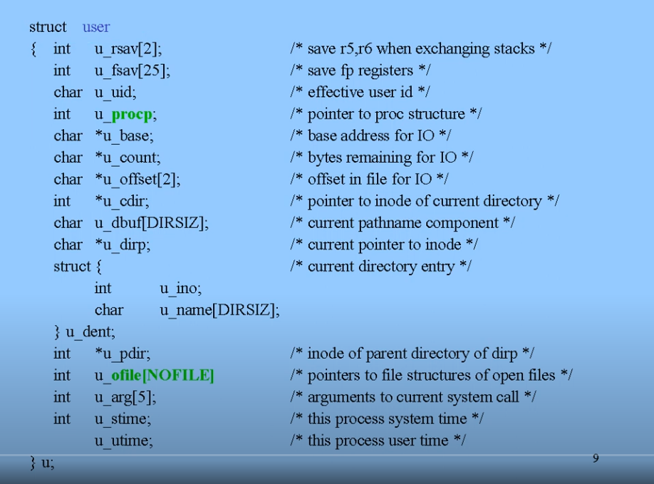
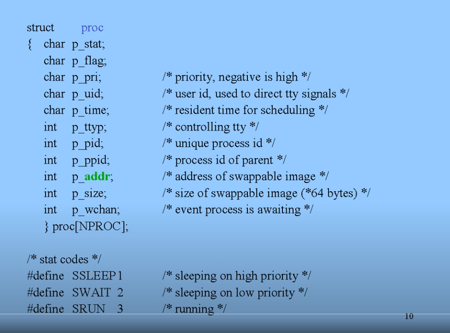

# Process Management
프로세스를 관리하기 위해선 다음과 같은 사항이 필요하다.
1. 프로세스를 관리하기 위한 데이터 구조
2. 프로세스를 관리하기 위한 함수

PCB : 프로세스를 위한 메타 데이터. 대략 킬로바이트 단위로 크기가 크다.
하지만 이러한 데이터 구조를 모든 프로세스에 두기에는 자원의 낭비가 크다. 그러면 어떻게 해야할까?

Observation :
대부분의 프로세스는 사람과 상호작용하기 때문에, 대부분 idle하게 보낸다.
- 그렇다면 상호작용하지 않는 순간에는 swapped out 하여 메모리를 차지하지 않게 디스크로 보내버릴 수 있다
- 그렇다면 swapped out된 프로그램의 PCB는?
  - swap되지 말아야 하는 부분을 나눠서, 이 부분은 메모리에 남게 하고, 나머지는 디스크로 보내면 된다.
  - 항상 메모리에 남아있어야 하는 부분 : `proc`
    - PID, waiting event, status, priority, location of image in disk ...
  - 디스크로 swapped out해도 되는 부분 : `user`
    - u-block이라고 불리기도 한다.
    - 프로그램이 메인 메모리에 올라온 이후 필요한 부분.

Status Vector Save Area
- CPU에는 여러 개의 레지스터가 있는데, 이 레지스터를 모아 놓은 벡터.
- 즉, CPU의 현재 상태를 나타낸다.
- 현대 프로세스가 CPU를 사용하던 상태를 저장해야 하는 경우, 이 벡터를 PCB의 Status Vector Save Area에 저장한다.

PCB : `user` + `proc` + kernel stack
- user stack은 프로세스가 개별적으로 가진다.
- kernel stack : chain of function calls (return address, parameter, local variables) -> kernel control path
- 커널의 함수와 변수들은 shared data이다. 다른 프로그램도 함께 사용하기 때문.

커널은 프로세스마다 하나의 kernel stack을 할당한다. 각 프로세스는 자신만의 user stack을 가진다.

## System Call

fork : memory work
exed : disk work

### `fork`
자식이 부모의 PCB를 복사하고, 부모의 프로세스 이미지(즉 상태)를 복사한다.
- `user` PCB에는 tty, current dir, open files, location of image ... 등 프로세스의 환경이 담겨있다.
- 이를 복사하므로, 자식은 부모의 프로세스 환경을 상속하게 된다.
  - 부모가 `sh` 명령을 실행하고 있으면, 자식도 `sh` 명령을 실행하게 된다 -> subshell
- 부모와 자식의 차이점은 PID, 즉 별개의 프로세스이기 때문에 메모리 공유가 안 된다.
- `fork`는 프로세스의 수를 증가시키는 유일한 방법.
- `fork`는 두 번의 return이 발생한다.
  - `pid = fork()`
  - 부모의 PC는 `fork`를 호출한 상태
  - 부모의 PCB를 복사한 자식의 PCB도 `fork`를 호출한 상태.
  - 따라서 자식도 `pid = fork()` 로부터 시작한다.
  - CPU가 부모를 호출하면 `fork`의 반환이 발생
  - 마찬가지로 CPU가 자식을 호출하면 `fork`의 반환이 발생
-> 두 번의 `fork` 반환!

### `exec`
디스크로부터 특정 파일을 가져와서 실행한다.
1. 파일을 메모리로 load한다.
2. 파일의 처음 몇 바이트를 읽는다(magic number)
   1. 무슨 파일인지(binary 파일인지, text 파일인지, script 파일인지 ...)
   2. binary면 그냥 실행, script 파일이면 인터프리터를 실행
3. 새로운 실행 스택을 만든다(argv, envp)

### `wait`
`wait` system call을 호출하는 프로세스는 CPU가 실행되지 않게 한다(preempt CPU)
- 자식이 실행을 끝날 때까지 CPU를 뺏고, 자식이 실행이 끝나면 커널에게 시그널이 간다.
- 시그널을 받은 커널은 부모를 ready queue에 넣어 CPU가 실행되게 한다.
- `ls bin` -> wait
- `ls bin&` -> no wait

# Booting the Kernel
1. 맨 처음에는 RAM이 비어있다. 부트로더, 커널을 포함한 모든 프로그램은 디스크에 있음.
2. CPU는 ROM에 있는 bootstraping 로더를 실행하고, ROM에 있는 로더가 디스크의 부트로더를 RAM으로 가져온다.
3. RAM에 올라간 부트로더가 커널을 가져온다.
4. 커널은 process 0을 만든다 -> root process
   1. root process - CPU 스케줄링을 하는 프로세스
   2. 이 프로세스로부터 `fork` 된 것이 process 1 -> `/etc/init`
5. init process
   1. tty console을 초기화해서 관리자를 위한 shell을 실행한다
      1. single user mode, operator console
   2. 이후 다른 유저의 접속을 위한 터미널 shell을 실행한다
      1. getty
      2. login 메세지를 띄우고 로그인을 기다린다
   3. 유저가 getty에서 로그인을 성공하면, `exec`하여 로그인 과정을 진행한다.
      1. 로그인 과정은 패스워드 입력을 기다린다.
   4. 유저가 패스워드를 입력하고 검증되면, `exec`하여 shell 프로세스를 실행한다.
   5. 이제 우리에게 익숙한 shell이 뜬다.

이 과정은 돌아올 필요가 없기 때문에 `exec`으로 한다. 돌아올 필요가 있으면 `fork` 하고 `exec`을 해야함.

## 6 run levels
- 0 - shutdown
- 1 - single-user mode (reserved for administration)
- 2 - multi-user mode
- 3 - multi-user mode as network server
- 4 - X window workstation
- 5 - reboot (reserved)