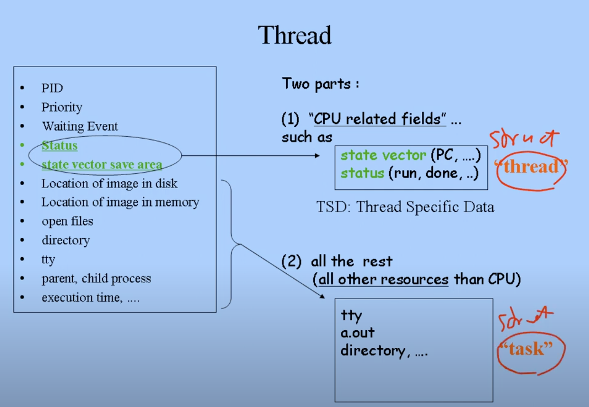

# Threads
하나의 작업을 분산하여 처리하기 위해선 어떻게 해야할까? `fork()` 시스템 콜을 활용하여 CPU 코어에 분배하여 작업을 수행할 수도 있겠지만, `fork()` 시스템 콜은 오버헤드가 크다는 단점이 있다.

왜냐하면 `fork()` 시스템 콜은 생성된 자식이 부모의 PCB를 모두 복사하여 가지게 되고, PCB의 크기는 KB 단위로, 이러한 복사 과정에서 메모리 read/write 오버헤드가 발생할 수 있다.

또한 작업을 분산하여 처리한다 해도, 모든 CPU가 PCB의 모든 내용을 동일하게 복사하여 가질 필요가 있을까? 어차피 하나의 프로세스에서 실행되는 작업을 처리하는 것이기 때문에 directory, TTY, 프로세스이미지의 메모리 상 위치와 같은 정보는 어느 CPU던 동일한 정보를 가질 것이다.

따라서, 위와 같은 작업에는 CPU 관련 필드(CPU status, state vector save area ...)만 필요하다. 나머지 정보들은 하나의 PCB copy를 공유하여 사용할 수 있다. -> Thread

위 그림처럼 PCB를 `struct thread`, `struct task` 부분으로 나눠, Thread는 분산 작업 시 `struct thread`를 가지고서 작업을 독립적으로 진행한다.

이렇게 PCB 개념을 나눈 것이 MACH의 컨셉으로, CPU 실행 관련 정보만 복사하기 때문에 `fork()` 시스템콜보다 오버헤드가 작아진다는 장점이 있다. 하지만 모든 커널이 MACH의 컨셉을 공유하는 것은 아니므로, 아키텍처 별로 확인할 점이 있다. (가령 스레드가 커널에 의해 처리되거나, 유저 라이브러리에 의해 처리되거나, 리얼타임으로 스레드가 동작하거나 ...)

# Process Termination
프로세스가 끝나는 방식은 두 가지가 있다.
1. 프로세스가 원해서 끝나는 방식 (Voluntary)
   1. `exit()` 시스템 콜을 호출하고 종료한다.
2. 프로세스가 원하지 않지만 끝나게 되는 방식 (Involuntary)
   1. `Ctrl + C`와 같은 시그널을 받았을 때
   2. 인터럽트를 받았을 때
      1. 터미널에서 실행 중인 프로세스의 PCB에 bit을 세팅한다.
      2. 만약 대상 프로세스가 동작중이라면 프로세스를 즉시 중지시킨다.
      3. 만약 대상 프로세스가 sleeping이라면, 프로세스가 깨어날 때(dispatch) 중지시킨다.

`exit()` 시스템 콜이 호출되면...
1. 파일을 close 한다.
2. 프로세스 이미지를 메모리에서 해제한다(deallocate)
3. CPU를 뺏는다 -> 다른 프로세스에게 CPU를 준다(`swtch()`)
4. `fork`된 자식 프로세스라면, 부모에게 신호를 보낸다
   1. 커널은 부모에게 자식의 PCB를 전달한다
   2. 부모는 자식의 PCB 정보를 자신에게 복사하여 누적한다. 이 과정에서 자식 프로세스의 state는 ZOMBIE 상태가 된다.
   3. 이후 부모가 자식의 PCB 정보를 지우면, 자식의 state가 사라지게 된다.
5. `exit` 시스템 콜은 모든 시그널을 무시한다.

# 프로세스 관련 시스템 콜
- `fork` : create a child(copy)
- `exec` : overlay new image, analogous to `goto`
- `wait` : sleep until child is done
- `exit` : frees all the resources, notify parent

`swtch()` 라는 커널 내부 함수가 있는데(커널 내부 함수미으로, 커널 내에서만 볼 수 있다), 호출한 프로세스를 block하고 CPU를 뺏는 역할을 한다.
- `read`, `wait`, `exit`과 같은 시스템 콜이 `swtch()` 함수를 사용한다.

`swtch()` 함수를 호출하면...
1. 현재 CPU 상태(register, state vector ...)를 저장한다. 즉 PCB의 `user` 영역에 정보를 복사한다.
2. 호출한 프로세스를 sleep 상태로 전환한다. 이 정보는 PCB의 `proc` 영역에 표시한다.
3. ready queue에 가서 우선 순위가 높은 프로세스를 찾는다.
4. 해당하는 프로세스에게 CPU를 준다(즉, CPU 레지스터에 새로운 값을 넣는다).

# 프로세스 진행 예제 (`read`)
1. 유저 프로세스가 `read` 시스템 콜을 호출한다.
2. 커널 모드로 진입하여, 프로세스의 요청(disk request)을 disk I/O queue에 전달한다.
   1. DMA가 끝날 때까지 기다려야 하므로, `swtch()` 를 호출하여 CPU를 다른 프로세스에게 넘긴다.
   2. 이후 해당 프로세스는 kernel 안에서 sleep 상태로 전환된다.
3. `swtch()` 함수는 CPU state를 해당 프로세스의 PCB에 저장하고, 새로운 프로세스의 state vector를 CPU에 로드하여, 새로운 프로세스를 실행한다.
4. 새로운 프로세스가 `exit`을 호출하여 작업을 끝내면, 다른 프로세스를 동일한 방식으로 실행한다 ...
5. 만약 I/O 작업이 끝나 인터럽트가 전달되면, 커널은 sleep 상태의 프로세스를 ready queue에 옮긴다.
6. 해당 프로세스는 스케줄링 정책에 따라 CPU에 올라가게 되고, `read` 시스템 콜이 종료된다.

# 프로세스 정리
- 프로그램은 static(즉, 코드 자체), 프로세스는 dynamic
  - 프로그램이 dynamic하게 실행되려면(program in execution) **리소스**를 받아야 한다.
    - 메모리 리소스(load)
    - CPU (dispatch)
    - ...
  - 즉, 프로세스는 프로그램 + 리소스
- 프로세스는 스케줄링의 단위
- 프로세스는 리소스를 할당받는 단위
- 프로세스는 protection domain을 가진다(page table, files ...)
- 프로세스는 user mode, kernel mode에서 실행 가능하다.

## Context
1. user space
   1. `a.out` : text, data, bss, heap, stack
2. kernel space
   1. PCB : (`user`, `proc`), stack ...
3. Hardware
   1. PC, SP, flags ... -> CPU state vector

# Daemon Process
- `a.out` 형식의 포맷이지만, 아래와 같은 조건을 가진다.
1. 머신이 boot될 때 같이 시작된다.
2. 서버(daemon)은 평소에는 sleep 상태.
3. 만약 외부에서 요청이 도착하면 깨어나서 서비스를 제공하고 다시 sleep 상태로 빠진다.
4. 위 조건을 반복한다. (always waiting - loop)

network, paging ... 과 같은 데몬 프로세스가 있다.

MEMO
- `ps` : 내 터미널 프로세스만 뜸
- `ps -e` : 모든 프로세스가 뜸

# IPC (Inter Process Communication)
프로세스 간 통신을 하려 해도, 각 프로세스는 커널에 의해 도메인이 보호되고 있다(protection domain). 즉, 커널을 통해 프로세스 간 데이터를 송수신해야 하는데, 이를 위해 커널은 IPC 시스템 콜을 유저에게 제공한다.

목적에 따른 다양한 IPC 시스템 콜이 있다:
- pipe - 1-way pipe, unlimited size file (R, W-process), ring buffer
- socket - 2-way pipe, returns 2 file descriptors, ring buffer
- shared memory : fastest
- semaphore - process control(block / wake-up - atomic)
- signal - process control(handler function - kill, resume ...), 1 bit, fast

즉, 데이터의 크기, 속도, 빈도 등에 따라 다양한 IPC 시스템 콜이 사용된다.