# File System
1. Data Structure
2. Functions

## FCB (File Control Block)
- 파일을 관리하기 위해 가지고 있어야 하는 메타 데이터
  - owner
  - protection
  - device
  - content(sector address)
  - device driver routines(read, open ...)
  - accessing where to(offset)
- 디스크에 저장되어 있다.
- 파일이 어디에 저장되어 있는지 정보를 담고 있다.

리눅스 커널이 `read`, `write` 시스템 콜을 수행하려면 FCB에 접근해야 한다.
- `read`, `write` 시스템 콜은 sequential하게 진행된다.
- offset : 파일을 어디부터 읽어서 데이터를 가져와야 하는가 - sequential access
  - 즉, 0부터 순서대로 읽는다는 의미
- UNIX에서는 random access를 위한 `lseek` 시스템 콜이 따로 있다.

contiguous allocation의 경우, space management가 어려워진다.
- 파일을 빠르게 접근할 수 있지만, holes가 많이 생겨 파일을 저장하기 어려워진다.
  - external fragmentation
  - swap이나 device copy를 하는 상황에는 contiguous allocation이 적합하다.
- 따라서 파일 저장에는 scattered allocation이 적합하다.
  - non-contiguously하게 sector 크기로 나눠 저장 장치에 분산하여 저장한다.

UNIX의 경우, 디스크를 contiguous, non-contiguous 영역으로 나눠, 전자에는 일반 파일을, 후자에는 swap 파일을 저장하는 데 사용한다.
- swap은 메모리 영역을 통쨰로 복사해야 하므로, 빠르게 실행되어야 하기 때문.

만약 `open` 시스템 콜이 호출되면, 커널은 디스크의 FCB(File Metadata)를 메모리로 가져온다. 그리고 메모리에 로드된 파일 메타데이터를 바탕으로, 디스크에서 가지고 올 대상 파일을 가져올 수 있다.

만약 여러 프로세스가 모두 `open`을 호출하면, 모든 프로세스에게 동일한 file metadata를 통째로 복사해서 전달해야 할까?
- 만약 여러 프로세스가 동일한 파일을 여는 경우
- 하지만 이 경우, 모든 정보를 복사해서 줄 필요는 없다.
  - owner, protection, device, pointer to file content, device driver routine ...
  - 이러한 정보들은 단일한 file metadata를 모든 프로세스가 share할 수 있다
  - `struct inode`
- 하지만 offset의 경우, 각 프로세스가 파일의 서로 다른 부분에 접근할 수 있기에,  share할 수 없다.
  - `struct file`
- 즉, private, systemwide 정보 구분에 따라 FCB를 `file`, `inode` 로 구분하여 나눌 수 있다.

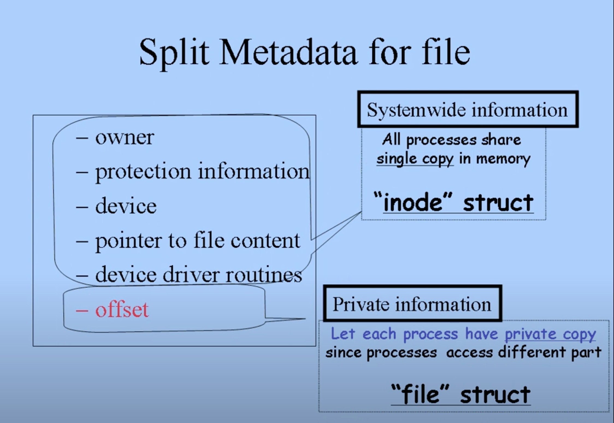
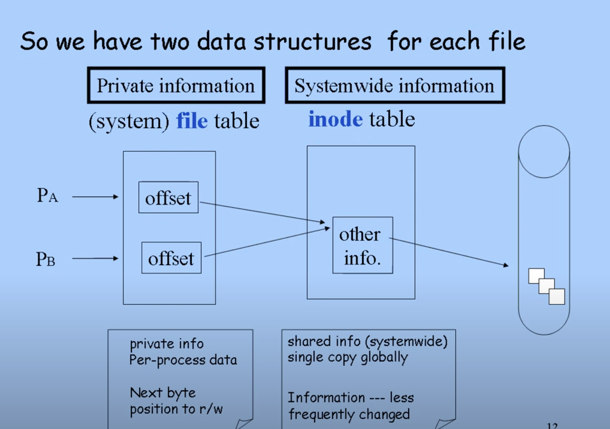
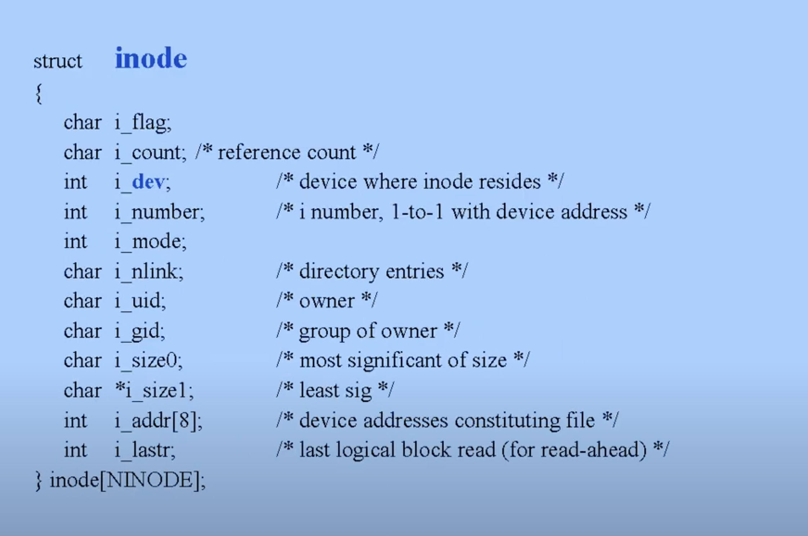

- `i_dev` : 저장 디바이스 (CD, HDD ...)

# Sharing Files
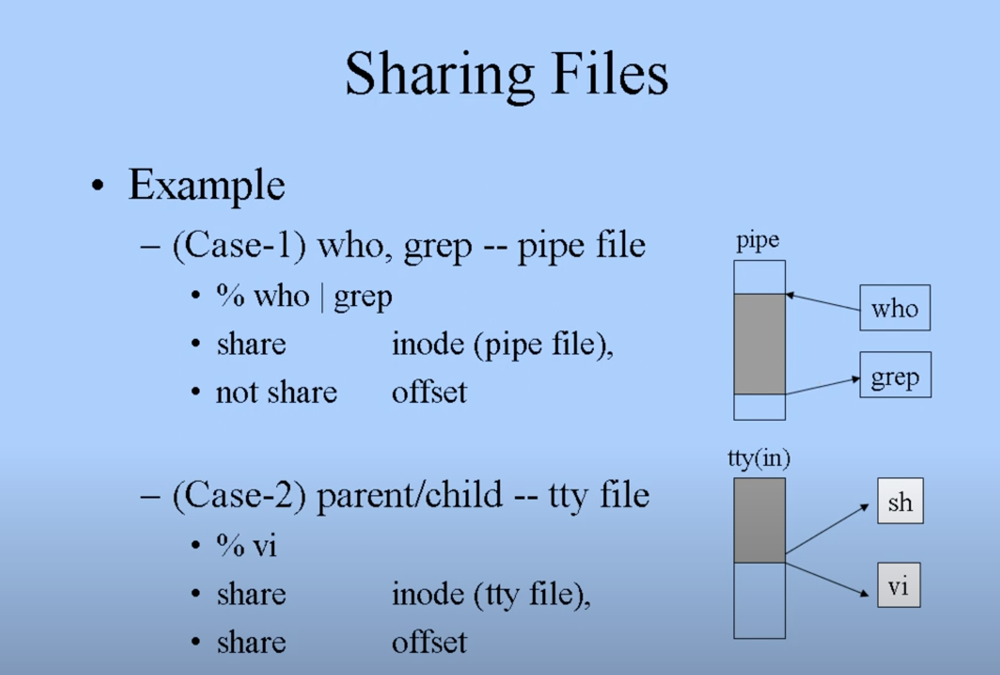
- 첫 번째 케이스는 두 개의 프로세스가 동일한 파일을 공유하지만 offset이 다른 경우를 나타낸다.
- 두 번째 케이스는 두 개의 프로세스가 동일한 파일을 공유하면서 offset도 같은 경우를 나타낸다.
  - 터미널(TTY)도 파일로 취급하는 점을 기억하자. sequence of bytes, 즉 터미널에 입력되는 문자열이 담겨있다.

# Device Switch Table

- 2-dim array처럼 동작한다.
  - (device name, operation name)을 주게 되면, device driver routine의 start address가 반환된다.
  - device independence를 제공하는 경계선

# Kernel Tables After `open(/a/b)`
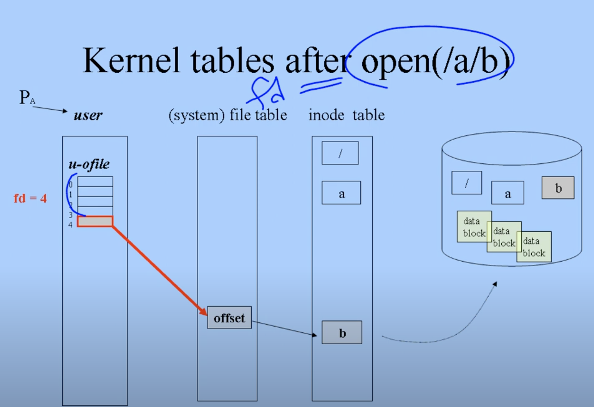
- `u-ofile` : `struct user`에 있으며, `open`한 파일에 대한 정보를 담고 있다.
  - 프로세스가 `open` 시스템 콜 호출 시, path name을 바탕으로 inode를 가지고 오고, offset을 초기화하며, offset을 가리키는 파일 디스크립터를 반환한다.
- file descriptor와 file handler는 다른 개념인데, file handler는 `fd + host`로, 네트워크에서도 파일 시스템을 접근하는 데 사용한다.
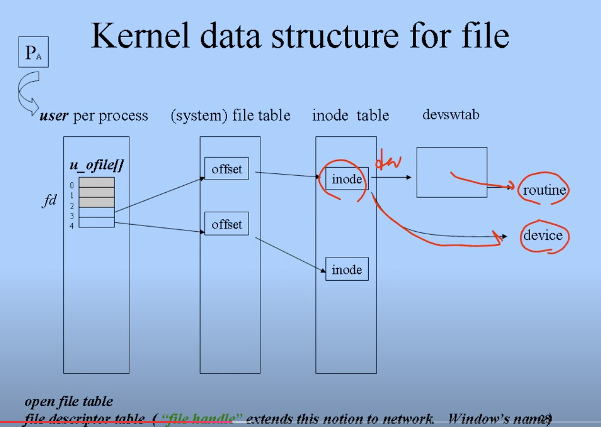

# Kernel Data Structure (with File System)
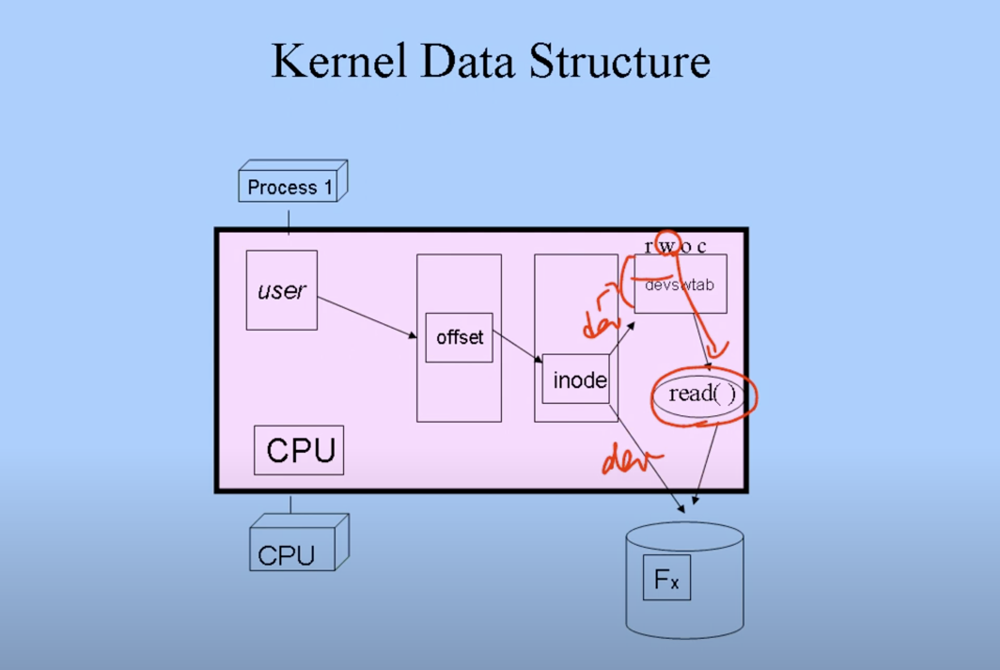

# System File Table 정리
- `struct file`
- 파일을 open, create, pipe하기 위해 생성
- 프로세스들이 공유할 수 있다.
- content
  - offset (inode table의 인덱스)
  - counter (number of processes sharing this entry)
  - pointer to inode table
  - r/w/x permission flag

# Inode Table 정리
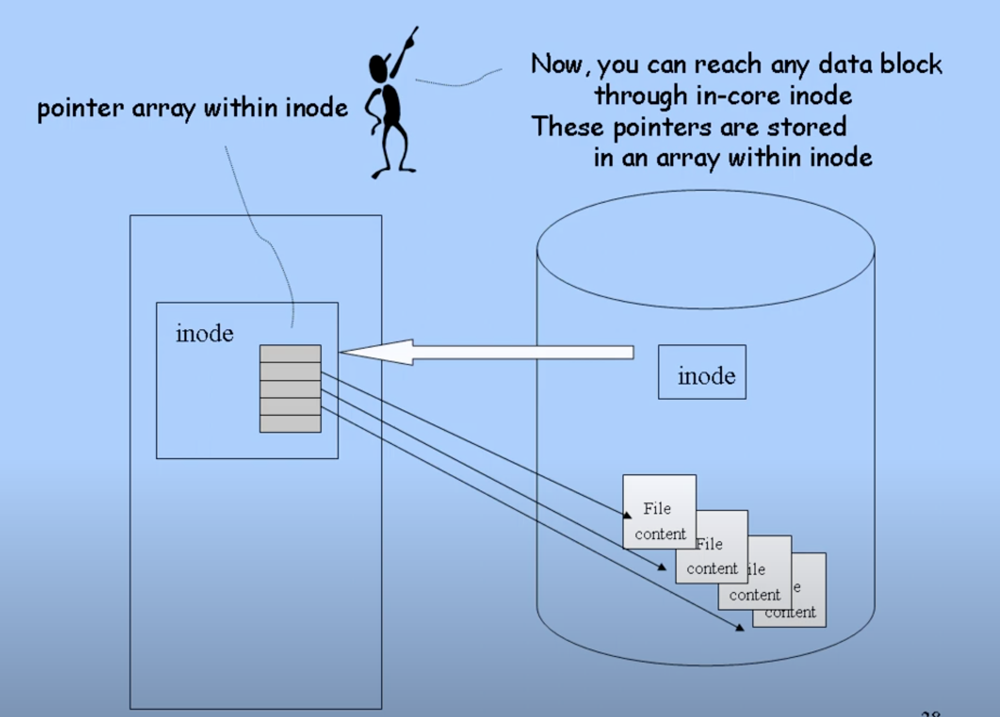
- 파일에 대한 대부분의 정보를 가지고 있다.
- 모든 프로세스가 공유한다.
- content
  - protection mode
  - owner
  - file size
  - pointer to sectors
  - ...
- inode가 메모리에 로드되면 아래의 정보가 테이블에 추가된다.
  - counter (number of processes sharing file)
  - device name(major/minor device number)
  - i-number (location of inode in disk)
  - statue (locked, mount point)
- 파일이 open 되면 inode만 메인 메모리로 copy되어 올라간다.
- inode 안에는 파일 컨텐트의 sector에 대한 포인터가 있다.

# Balanced Tree
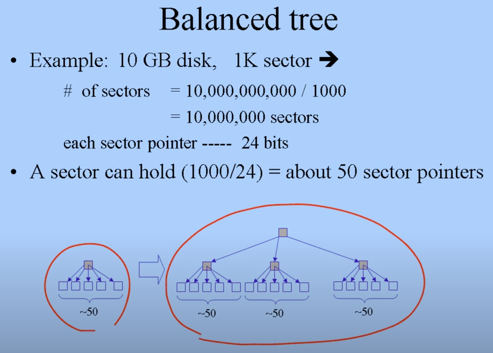
일반적으로 sector의 크기는 512KB. 만약 파일의 크기가 이보다 크다면, 파일은 여러 섹터의 집합을 가져야 하는데, 이 집합의 정보를 섹터 안에 담는다. 즉, 섹터를 파일 데이터를 저장하는 용도로 사용하기도 하지만, 섹터를 가리키는 테이블로도 사용하는 것이다.

위 이미지의 경우, 만약 디스크의 크기가 10GB이고 섹터가 1KB라고 한다면, 디스크 내 섹터를 모두 가리키기 위해선 24bit의 필드가 필요하고, 하나의 섹터는 이 필드들을 최대 50개 저장할 수 있다. (즉, 50개의 섹터에 대한 테이블을 만들 수 있다.)

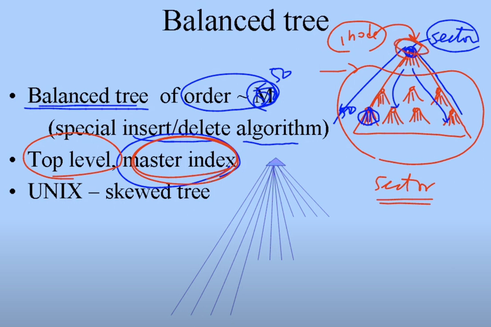
섹터를 관리하는 상위 섹터가 있다는 점에서, Balanced Tree 형태의 구조를 가지게 된다. UNIX의 경우, 한 쪽으로 치우쳐진 Tree 형태를 지니는데, 이를 skewed tree라고 부른다.

최상위(Top level) 섹터는 master indec라고 불리기도 한다. 파일의 아이노드를 가져올 때, 가장 먼저 최상위 아이노드를 메모리로 가져온다. 이 아이노드만 있으면 디스크 내 어떤 섹터든 가리킬 수 있기 때문이다.

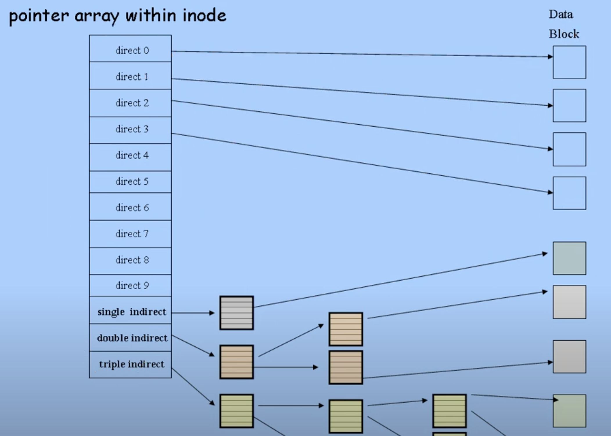
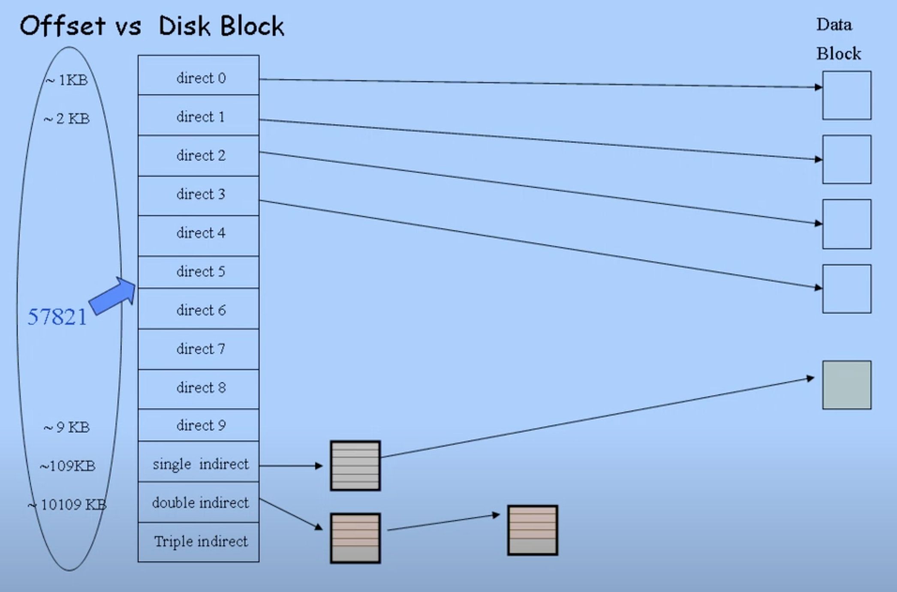
skewed tree : 어떤 파일은 링크를 한 번만 거쳐도 파일 컨텐트 섹터를 찾을 수 있고, 어떤 파일은 여러 번 거쳐야 찾을 수 있고...
- 링크를 거친다는 것은, 즉 디스크에 접근하는 경로의 수를 나타낸다.
위와 같이 UNIX가 skewed tree 형태를 가지는 이유는, UNIX는 Time Sharing 시스템이기 때문이다.
- 대부분의 파일은 사람이 생성한 파일로, 크기가 일반적으로 작다.
- 그리고 크기가 작은 파일은 하나의 섹터로 충분히 처리할 수 있다.
- 작은 파일들은 링크를 한 번만 거치게 하여 빠르게 접근하게 하고, 큰 파일은 여러 번 링크를 접근하게 하여(즉 multiple indirect 아이노드로 넣어) 느리게 접근하게 한다.

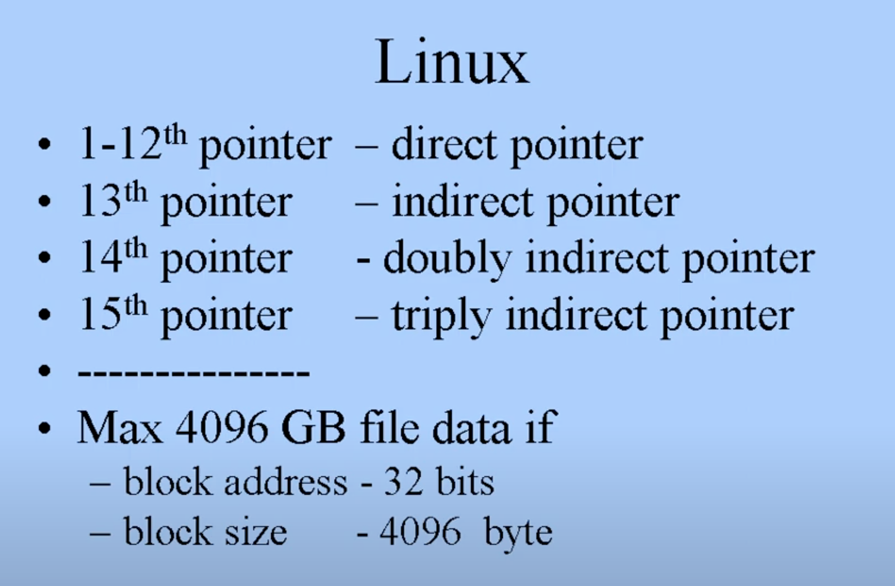

# Disk Space
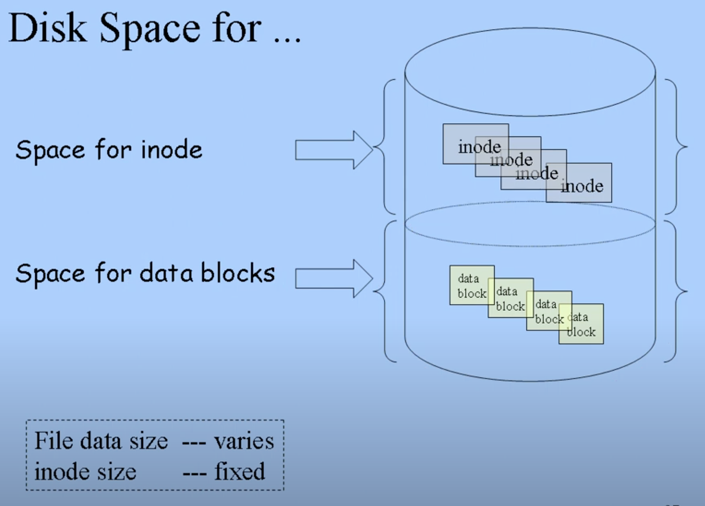
디스크 영역은 inode를 저장하는 영역과 data를 저장하는 영역으로 나뉘어진다.
아이노드의 사이즈는 고정되어 있다.
- i-number : 아이노드를 가리키는 번호
- 디스크 이름과 i-number를 알게 되면 아이노드를 알게 되고, 이로부터 파일 컨텐트를 가져올 수 있다.

# Directory File
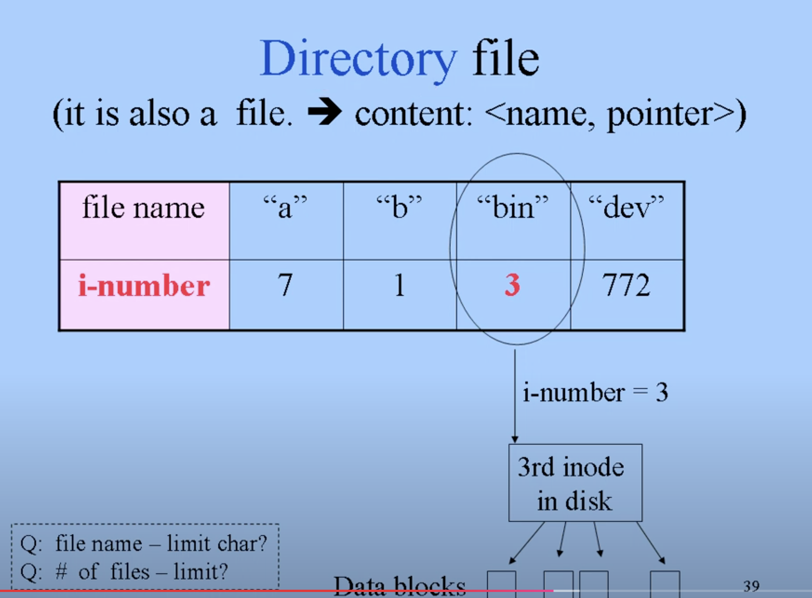
디렉토리도 파일이지만, <이름, 포인터>로 구성된 파일이다.
- 포인터 : i-number
- 파일 이름을 어떤 데이터 구조로 저장하느냐에 따라 파일 이름 생성에 제한이 발생한다.

# `open("/a/b")`
### 1. Root 아이노드를 메인 메모리로 올린다.
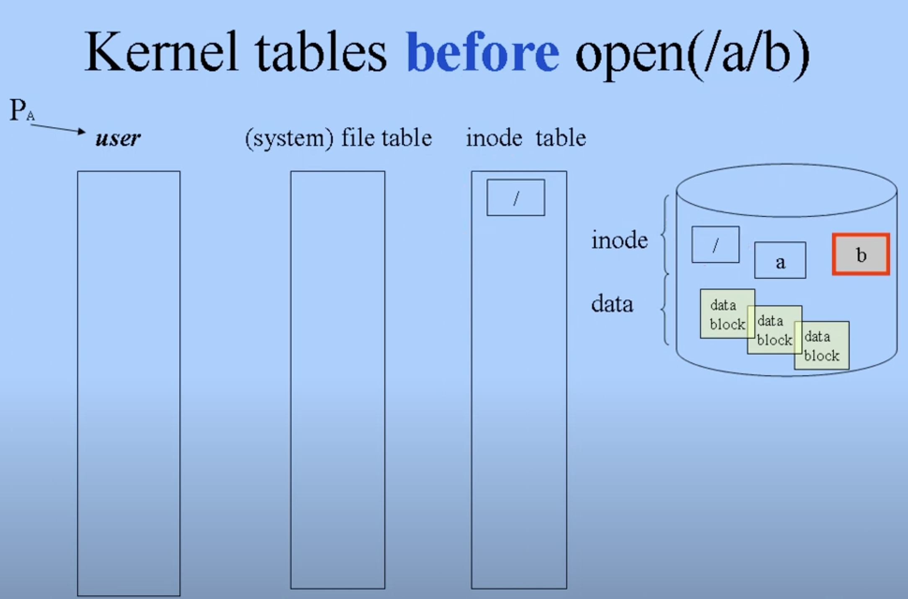

### 2. Root 아이노드로부터 Root 데이터 블럭을 디스크로부터 읽어 `a`를 찾는다.
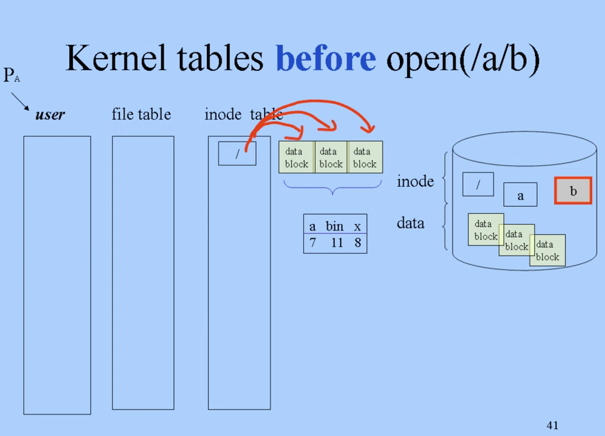
- 즉, 루트 아이노드로부터 루트 파일을 읽는 것이다.
- 루트 데이터블럭은 여기서 디렉터리이다.
- 디렉터리는 <파일 이름, i-number>로 구성된다.
- 루트 디렉터리에서 파일 이름 `a`를 찾는다.
- 파일 `a`의 i-number를 가지고, 디스크의 inode 영역으로 가서, `a`의 inode를 찾는다.

### 3. `a` 아이노드를 메인 메모리로 올린다. 그리고 동일하게 `b`를 찾는다.
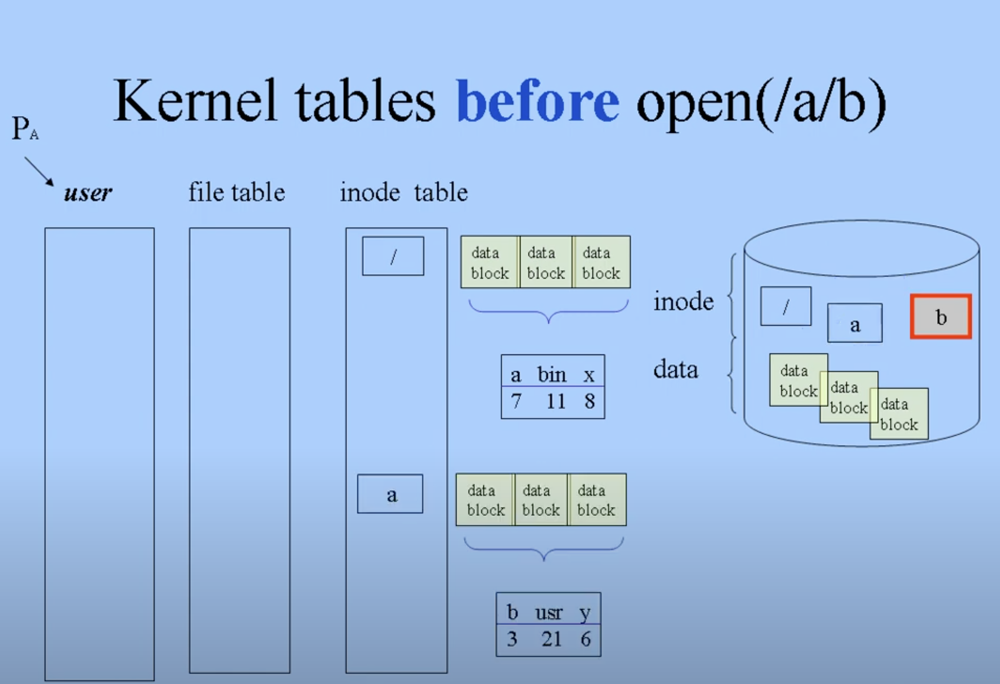
- 위와 동일하게, `a` 아이노드로부터 데이터 블록을 읽어서 파일 이름 `b`를 찾는다.
- 파일 `b`의 i-number를 가지고, 디스크의 아이노드 영역으로 가서 `b`를 찾는다.

### 4. `b` 아이노드를 메인 메모리로 올린다. 그리고 파일 디스크립터를 반환한다.
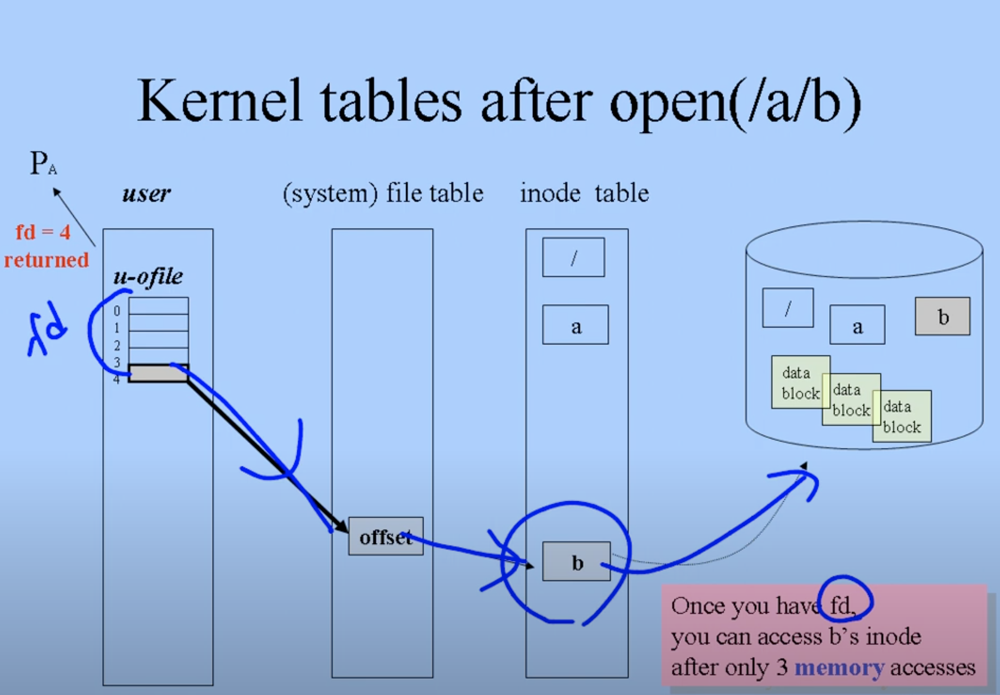
- 시스템 파일 테이블에 `b`를 가리키는 오프셋을 설정한다.
- 파일 디스크립터 테이블은 시스템 파일 테이블을 가리키는 인덱스를 반환한다.
- 이후, 파일 디스크립터를 사용하면 메인 메모리를 3번만 접근하여 파일에 대한 모든 정보를 알 수 있다.

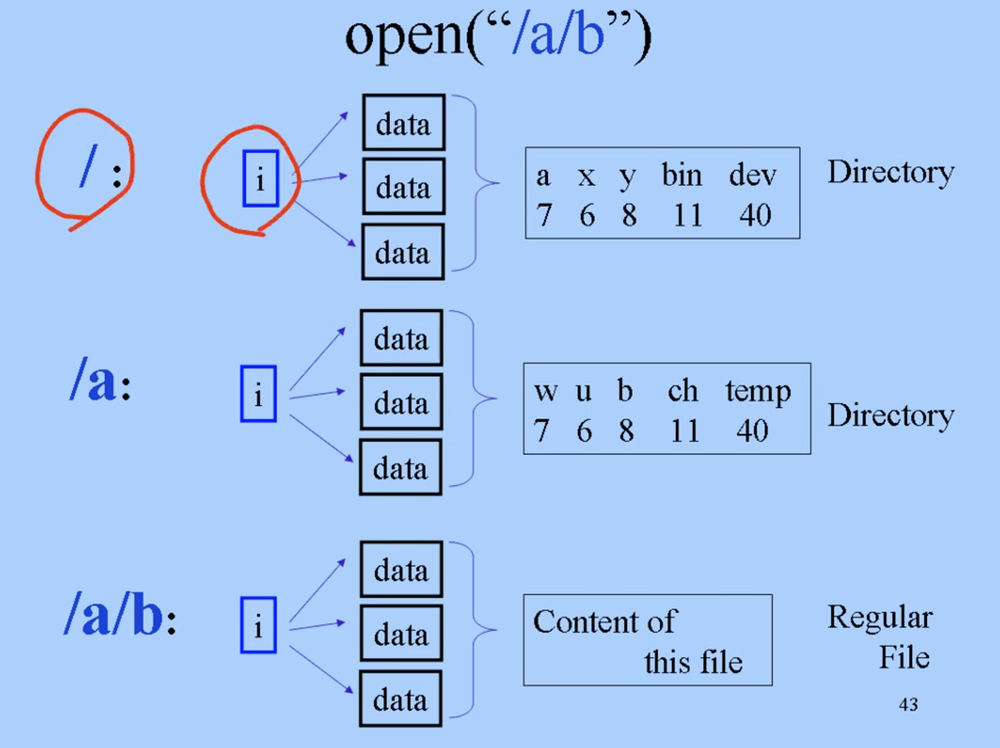

`open("/a/b")`는 코스트가 크다. 파일을 찾기 위해 디렉터리의 아이노드를 읽을 때, 이와 관련된 모든 아이노드를 읽기 때문이다. (흠... 사실 이 부분의 설명은 잘 모르겠다. 오히려 위처럼 아이노드를 모두 메모리로 가지고오는 과정이 많다는게 문제인 것 같다.) 따라서 반환된 파일 디스크립터를 가지고 파일을 다루는 것이 효율적이다.

# System call vs. Library call
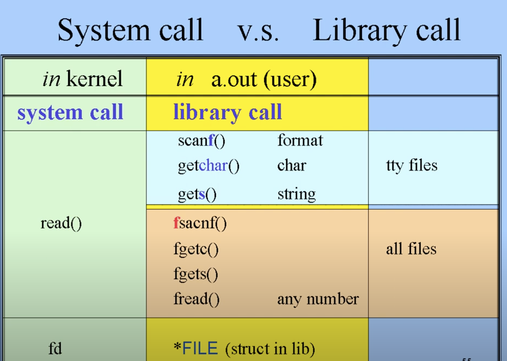
- `f`로 시작하지 않는 라이브러리 함수는 터미널(tty) 파일을 다루는 함수.
- 마지막 글자를 통해 라이브러리 함수가 어떤 작업을 하는 지 알 수 있다.

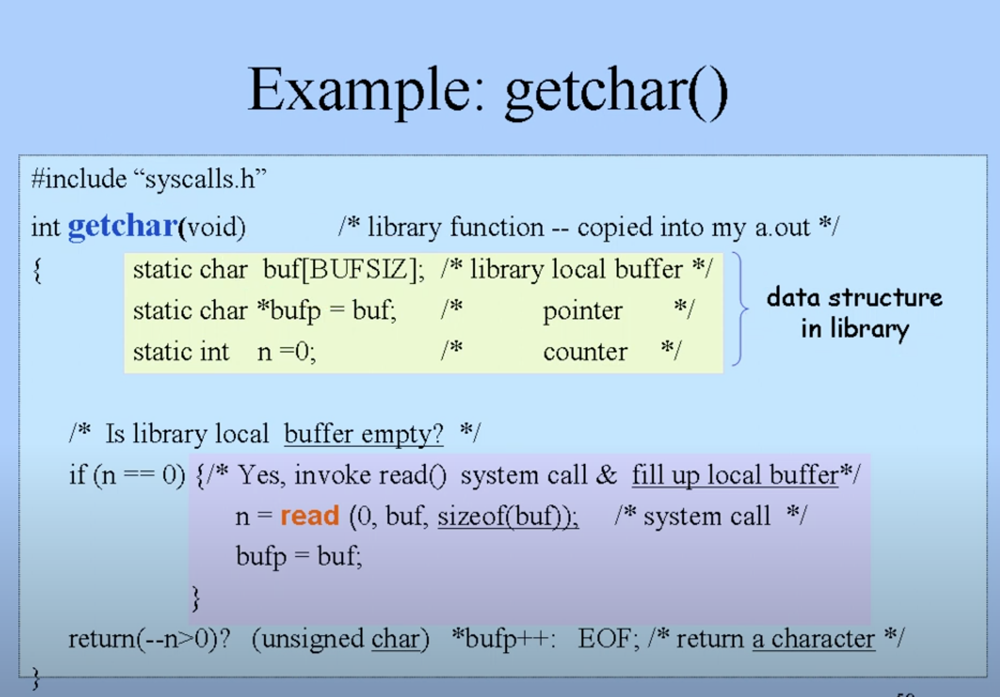
- 편의성, 퍼포먼스를 위해 라이브러리 함수를 사용한다.