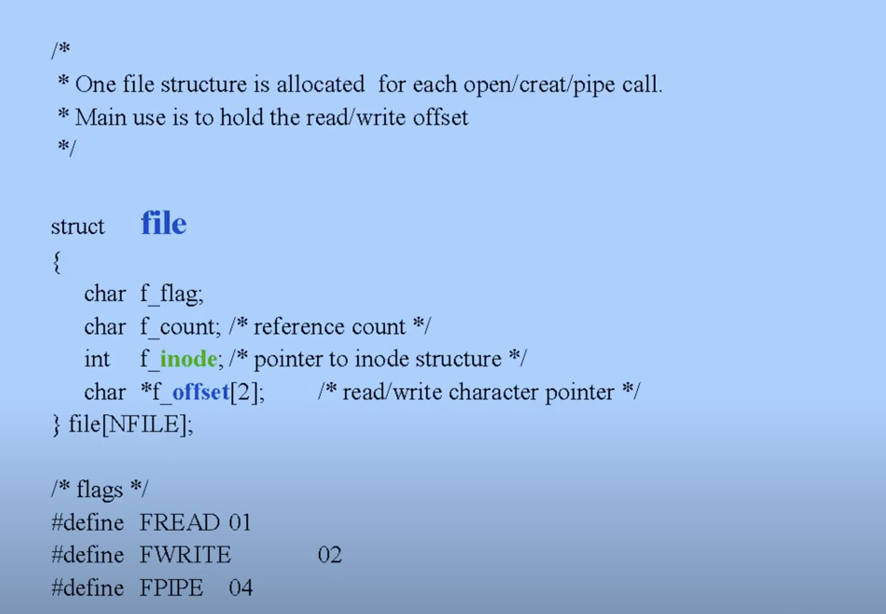
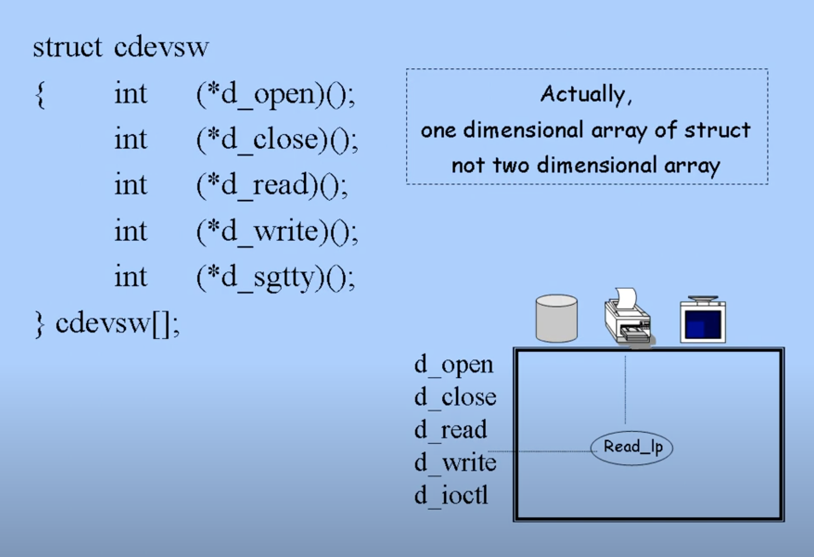

# File System
1. Data Structure
2. Functions

## FCB (File Control Block)
- 파일을 관리하기 위해 가지고 있어야 하는 메타 데이터
  - owner
  - protection
  - device
  - content(sector address)
  - device driver routines(read, open ...)
  - accessing where to(offset)
- 디스크에 저장되어 있다.
- 파일이 어디에 저장되어 있는지 정보를 담고 있다.

리눅스 커널이 `read`, `write` 시스템 콜을 수행하려면 FCB에 접근해야 한다.
- `read`, `write` 시스템 콜은 sequential하게 진행된다.
- offset : 파일을 어디부터 읽어서 데이터를 가져와야 하는가 - sequential access
  - 즉, 0부터 순서대로 읽는다는 의미
- UNIX에서는 random access를 위한 `lseek` 시스템 콜이 따로 있다.

contiguous allocation의 경우, space management가 어려워진다.
- 파일을 빠르게 접근할 수 있지만, holes가 많이 생겨 파일을 저장하기 어려워진다.
  - external fragmentation
  - swap이나 device copy를 하는 상황에는 contiguous allocation이 적합하다.
- 따라서 파일 저장에는 scattered allocation이 적합하다.
  - non-contiguously하게 sector 크기로 나눠 저장 장치에 분산하여 저장한다.

UNIX의 경우, 디스크를 contiguous, non-contiguous 영역으로 나눠, 전자에는 일반 파일을, 후자에는 swap 파일을 저장하는 데 사용한다.
- swap은 메모리 영역을 통쨰로 복사해야 하므로, 빠르게 실행되어야 하기 때문.

만약 `open` 시스템 콜이 호출되면, 커널은 디스크의 FCB(File Metadata)를 메모리로 가져온다. 그리고 메모리에 로드된 파일 메타데이터를 바탕으로, 디스크에서 가지고 올 대상 파일을 가져올 수 있다.

만약 여러 프로세스가 모두 `open`을 호출하면, 모든 프로세스에게 동일한 file metadata를 통째로 복사해서 전달해야 할까?
- 만약 여러 프로세스가 동일한 파일을 여는 경우
- 하지만 이 경우, 모든 정보를 복사해서 줄 필요는 없다.
  - owner, protection, device, pointer to file content, device driver routine ...
  - 이러한 정보들은 단일한 file metadata를 모든 프로세스가 share할 수 있다
  - `struct inode`
- 하지만 offset의 경우, 각 프로세스가 파일의 서로 다른 부분에 접근할 수 있기에,  share할 수 없다.
  - `struct file`
- 즉, private, systemwide 정보 구분에 따라 FCB를 `file`, `inode` 로 구분하여 나눌 수 있다.

- `i_dev` : 저장 디바이스 (CD, HDD ...)

# Sharing Files

- 첫 번째 케이스는 두 개의 프로세스가 동일한 파일을 공유하지만 offset이 다른 경우를 나타낸다.
- 두 번째 케이스는 두 개의 프로세스가 동일한 파일을 공유하면서 offset도 같은 경우를 나타낸다.
  - 터미널(TTY)도 파일로 취급하는 점을 기억하자. sequence of bytes, 즉 터미널에 입력되는 문자열이 담겨있다.

# Device Switch Table

- 2-dim array처럼 동작한다.
  - (device name, operation name)을 주게 되면, device driver routine의 start address가 반환된다.
  - device independence를 제공하는 경계선

# Kernel Tables After `open(/a/b)`

- `u-ofile` : `struct user`에 있으며, `open`한 파일에 대한 정보를 담고 있다.
  - 프로세스가 `open` 시스템 콜 호출 시, path name을 바탕으로 inode를 가지고 오고, offset을 초기화하며, offset을 가리키는 파일 디스크립터를 반환한다.
- file descriptor와 file handler는 다른 개념인데, file handler는 `fd + host`로, 네트워크에서도 파일 시스템을 접근하는 데 사용한다.

# Kernel Data Structure (with File System)

# System File Table 정리
- `struct file`
- 파일을 open, create, pipe하기 위해 생성
- 프로세스들이 공유할 수 있다.
- content
  - offset (inode table의 인덱스)
  - counter (number of processes sharing this entry)
  - pointer to inode table
  - r/w/x permission flag

# Inode Table 정리
- 파일에 대한 대부분의 정보를 가지고 있다.
- 모든 프로세스가 공유한다.
- content
  - protection mode
  - owner
  - file size
  - pointer to sectors
  - ...
- inode가 메모리에 로드되면 아래의 정보가 테이블에 추가된다.
  - counter (number of processes sharing file)
  - device name(major/minor device number)
  - i-number (location of inode in disk)
  - statue (locked, mount point)