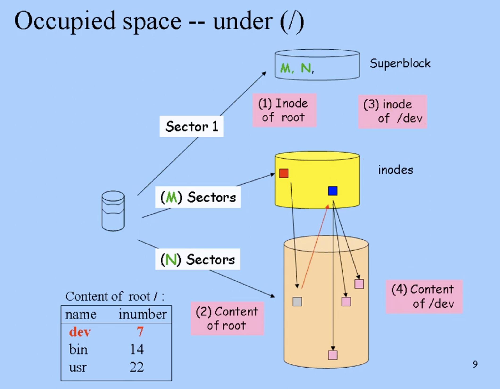

# File system in disk
지금까지 디스크에는 inode 영역과 data 영역만 있다고 했지만 사실 하나가 더 있다 : superblock

## superblock
- 파일 시스템에 대한 글로벌한 정보를 가지고 있다.
  - inode 영역의 사이즈
  - data 영역의 사이즈
  - 파일 시스템의 상태(permission, date ...)
- 파일 시스템의 free space 정보를 가진다.
  - inode 영역의 free space
  - data 영역의 free space

- `s` : superblock임을 의미.

## Free Space

free를 하게 되면 hold이 생기기 때문에, superblock은 free한 영역을 별도로 기억해야 한다.
  - free한 inode 영역을 기억하기 위한 헤더 포인터
  - free한 data 영역을 기억하기 위한 헤더 포인터

## Occupied Space

- inode(0) : root 디렉터리 파일을 가리킨다.
  - 이를 바탕으로 하위 파일들을 찾는다.
  - 이에 대한 정보를 모두 찾아서, 현재 사용중인 파일 크기를 계산할 수 있다.

따라서, superblock으로 디스크 안에 있는 모든 섹터에 대해, 사용중이거나 free된 영역을 알 수 있게 된다.
- 사용중인 영역 Root inode(0)으로부터 타고타고 내려가서
- free 영역은 superblock의 헤드 포인터로부터

## Boot Block
사실 디스크에는 superblock, inode 영역, data 영역 외에도 최상위 계층에 boot block이 있다. 이 영역은 부트로더를 저장한다.

**이 네 가지가 합쳐진 것이 파일 시스템이다.**

# File System

Logical Disk : 커널로 하여금 분산되어 저장된 섹터를, linear sequence로 여겨지게끔 하는 것.
- 섹터는 모두 동일한 크기이면서 random access가 가능하다.

파티션(Partition) : 물리적 디스크를 논리적으로 나눈 구역.
- 운영체제는 하나의 파티션을 별도의 디스크로 인식한다.
볼륨(Volume) : 데이터를 저장하는 논리적인 공간.

일반적으로 하나의 파티션에 하나의 파일 시스템이 존재한다. 하지만 여러 파티션으로 하나의 파일 시스템을 사용할 수도 있다.
- LVM : 여러 파티션을 묶어 하나의 논리 볼륨을 생성하고, 그 위에 파일 시스템을 생성한다.
- RAID : 여러 디스크와 파티션을 묶어 하나의 파일 시스템을 생성한다.

Logical formatting : 파일 시스템을 위한 데이터 구조를 초기화하는 것.
- 운영체제가 이해할 수 있도록.
Hardware formatting : 디스크를 초기화하는 과정.

UCB FFS(Fast File System)

- UNIX의 파일 시스템은 inode와 data 영역이 나뉘어져 있어, 이 두 사이를 왔다갔다하는 거리가 길어 seek 타임이 길어진다.
- 버클리대학은 inode와 data 영역을 별도로 나누지 않고 region으로 나눠, seek 타임을 낮추는 모델을 제시했다.